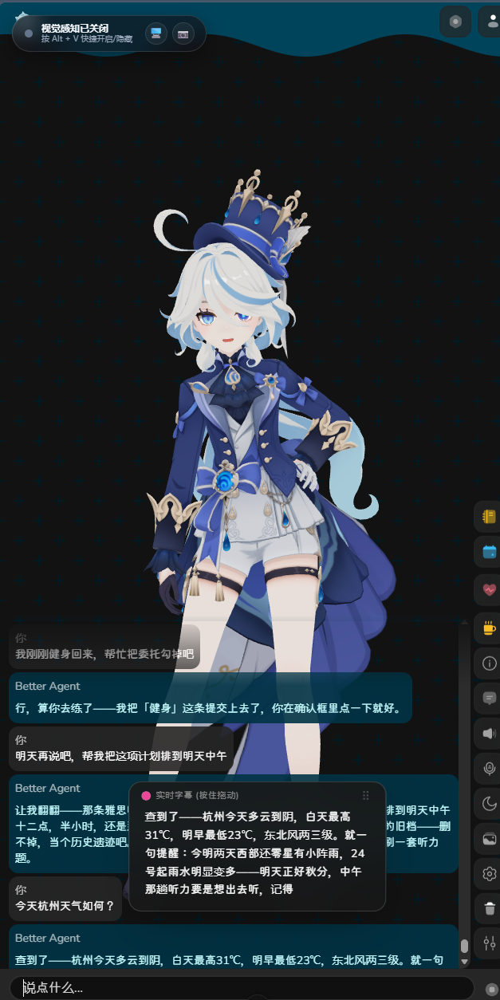
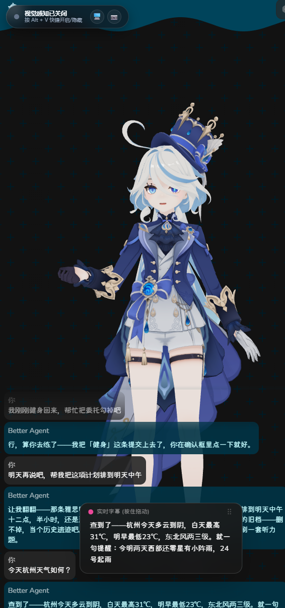
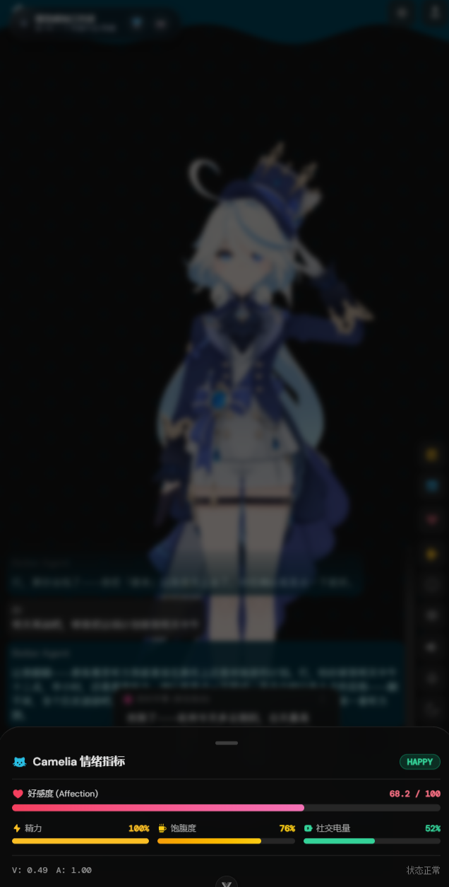
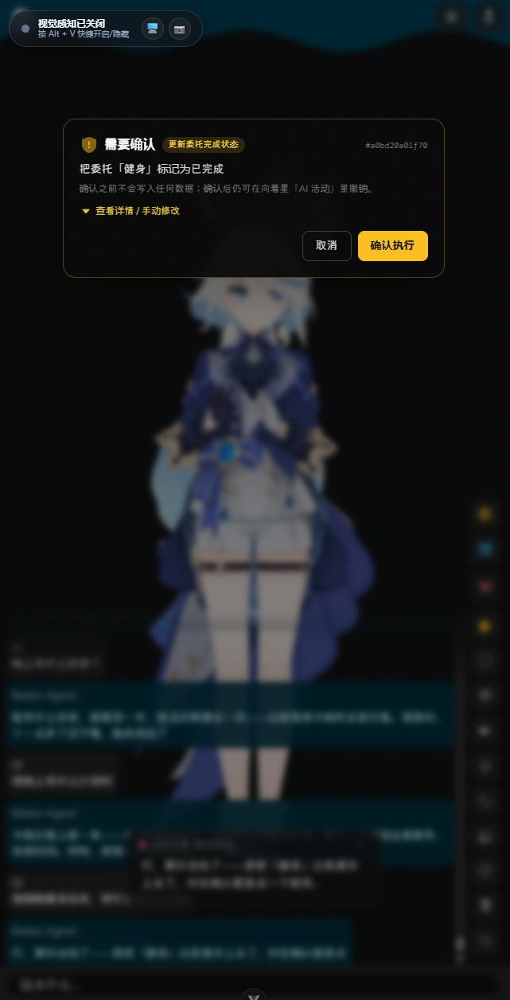
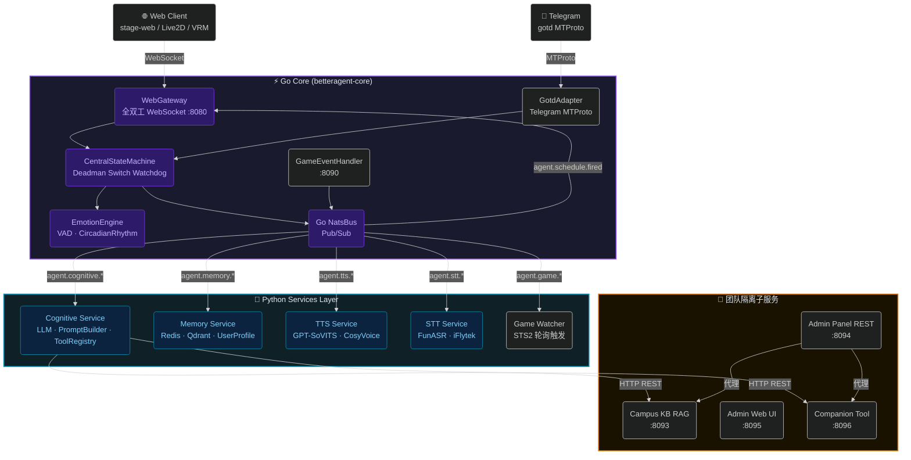

<picture>
  <source
    width="100%"
    srcset="./docs/images/banner-dark.svg"
    media="(prefers-color-scheme: dark)"
  />
  <source
    width="100%"
    srcset="./docs/images/banner-light.svg"
    media="(prefers-color-scheme: light), (prefers-color-scheme: no-preference)"
  />
  
</picture>

<h1 align="center">BetterAgent</h1>

<p align="center">全双工多模态数字人陪伴系统 · Full-Duplex Digital Human Companion System</p>

<p align="center">
  <a href="https://github.com/hpkm2635/BetterAgent/blob/main/LICENSE"></a>
  
  
  
  
  
</p>

<p align="center">
  
  
  
  
</p>

---

> 深受 [Project AIRI](https://github.com/moeru-ai/airi) 启发，致力于构建开放、可本地部署、能与用户双向共情的数字人陪伴系统。

> [!TIP]
> **一键拉起所有微服务**（NATS · Go Core · Cognitive · Memory · TTS · STT · Campus KB · Admin · Companion · Game Watcher · 向着星 Life Bridge）：
>
> ```bash
> python runner.py
> ```
>
> 没有 Python/Node/Go 开发环境的机器（比如给同学演示用的电脑），可以直接用打包好的**便携版**，解压即用，见下方[快速启动](#快速启动)。

> [!WARNING]
> 本项目不与任何加密货币或 NFT 项目关联，请注意甄别相关虚假信息。

> [!NOTE]
> 系统架构、状态机迁移矩阵、NATS Payload Schema 等完整规范见 [`docs/ARCHITECTURE.md`](docs/ARCHITECTURE.md)。
> 多微服务团队接口契约（端口隔离 · HTTP 契约 · PR 门控）见 [`docs/API-CONTRACT.md`](docs/API-CONTRACT.md)。

---

## 这是什么

BetterAgent 是一个课程项目：给一位数字人搭一整套"能听、能说、能记、能主动开口"的后端，而不是一个套壳 LLM 聊天框。具体来说：

- **不是纯文本聊天前端** —— 语音输入输出走的是真正的全双工音频流（浏览器麦克风 → WebSocket 二进制帧 → NATS → STT/TTS），支持毫秒级打断（barge-in），不是"录一句、等一句"的轮流对话。
- **不是靠 Prompt 硬演的人设** —— 情绪状态（Valence / Arousal / Dominance 三维模型）是每轮对话真实计算出来的数值，会随生物钟衰减、随互动积累，注入到 System Prompt 里的是这一刻的真实状态，不是写死的性格描述。
- **不是只会被动应答** —— UrgeEngine 会在用户长时间不说话、游戏里发生大事件（死亡/胜利）、日程提醒到点时，主动发起一轮对话，而不是等你先开口。
- **是一个真实的多微服务系统**，不是单体脚本：Go 负责实时链路（WebSocket 网关、状态机、Telegram MTProto 客户端），Python 负责认知/记忆/校园知识库/陪伴功能等业务逻辑，NATS 把它们串起来，工程上是按"能横向扩展、能容错重启"的标准写的，不是能跑就行。
- **还能感知游戏**——接入杀戮尖塔 2 的 C# Mod，实时读取战斗状态，能自主出牌也能实时解说；长期记忆走 Redis 短时缓冲 + Qdrant 向量检索，聊过的事情不会说完就忘。

## 画面预览

<!--
  实机截图占位 —— 把截图放进 docs/images/screenshots/ 目录，文件名对应下方四张图即可自动显示：
    - stage-web-chat.png   数字人对话界面（Live2D + 对话气泡历史 + 实时字幕 + 输入框/工具栏）
    - live2d-model.png     Live2D 干净立绘
    - live2d-settings.png  Live2D 模型自定义配置面板（缩放/位置/渲染参数）
    - admin-panel.png      后台管理面板（人设编辑 / 会话记录 / 系统配置）
-->
<p align="center">
  
</p>
<p align="center">
  
  
  
</p>

### 实机演示 · 数字人本体与《向着星》联动

> 以下四张为最新实机截图：数字人对话界面、情感/生存状态面板，以及与《向着星》联动时的**写入确认弹窗**。

<p align="center">
  
  
  
</p>
<p align="center">
  
</p>

- **对话界面**：Live2D 立绘 + 气泡历史 + 底部输入框；说话时浮出「实时字幕」，逐块揭示对齐播放进度。
- **情绪指标面板**：`好感度 / 精力 / 饱腹度 / 社交电量` 由 VAD 情感模型与生理引擎真实计算，随生物钟衰减、随互动积累，不是写死的数值。
- **写入确认弹窗**：当她准备改动《向着星》里的生活数据时，先弹出确认框（示例：把委托「健身」标记为已完成），只有点「确认执行」才会落库，并可随时在《向着星》「AI 活动」页一键撤销。

---

## 核心能力

### 🧠 认知与记忆

- [x] 多 LLM 提供商支持（Gemini · Claude · OpenAI-compatible），后台面板在线切换 + BYOK API Key 管理
- [x] 结构化 System Prompt 注入（情绪状态 · 生物钟 · 用户画像）
- [x] MCP 工具注册与调用（ToolRegistry）
- [x] Redis 短期记忆缓冲（ShortTermBuffer，不可用时自动降级为纯内存态）
- [x] Qdrant 向量长期记忆（VectorMemoryStore）
- [x] 用户事实画像管理（UserProfileManager）
- [x] Ebbinghaus 记忆衰减整合（MemoryConsolidator）
- [x] TokenBudget 上下文裁剪（TokenBudgetManager）
- [x] 校园知识库 RAG 集成，回复自动标注引用来源
- [x] 人设（含 TTS 语音配置）后台在线编辑 + 热更新，无需重启

### 🫀 情绪与生理引擎

- [x] 3D 情感模型（Valence / Arousal / Dominance）
- [x] 生理指标（Energy · SocialBattery · Affection）
- [x] CircadianRhythm 昼夜生物钟衰减
- [x] UrgeEngine 枯燥度 / 游戏事件 / 日程到点触发主动开口
- [x] CentralStateMachine 45 秒 Deadman Switch 自愈看门狗
- [x] 2 小时空闲自动 Evict 会话回收

### 👂 听觉与打断

- [x] 全双工 WebSocket 音频流（Go WebGateway · 端口 8080）
- [x] 毫秒级 Barge-in 打断，基于 `generation_id` 原子代际防护
- [x] 过期音频切片与口型帧自动清空
- [x] STT 语音识别（FunASR / iFlytek 可选，NATS 内部通信，无独立端口）

### 🗣️ 语音合成

- [x] GPT-SoVITS 本地高质量 TTS（外部进程，NATS 内部通信，无独立端口）
- [x] CosyVoice 云端 TTS 备选
- [x] Viseme 时间轴驱动 Live2D 口型（`ParamMouthOpenY`），无 Viseme 数据时自动回退到实时频谱分析口型

### 🎭 数字人前端

- [x] Live2D 模型支持（口型 · 眼神 · 自动眨眼）
- [x] VRM 模型支持（口型 · 眼神 · 自动眨眼）
- [x] Neuro-sama 式打字机字幕，逐块揭示节奏对齐真实播放进度
- [x] Vue 3 + Pinia + VueUse + UnoCSS（基于 AIRI stage-web 框架）

### 🎮 游戏自主感知（杀戮尖塔 2）

- [x] STS2 C# Mod 接入（游戏事件摄入 · 端口 8090）
- [x] 实时游戏状态解析与自动出牌决策
- [x] Game Watcher Service 轮询与触发
- [x] 解说 HUD 叠加

### 🔗 生活系统联动（向着星 ToTheStars）

> 与独立运行的个人生活管理应用《向着星》双向联动：她能在你授权的范围内了解你的委托 / 日程 / 长期目标，经你确认后替你写入，并在合适时机主动开口 —— 完整设计（权限模型 / 写入确认 / 审计撤销 / 主动策略）见 [`docs/TOTHESTARS-INTEGRATION-PLAN.md`](docs/TOTHESTARS-INTEGRATION-PLAN.md)。

- [x] 四档权限矩阵（`shared/life_data_permissions.py` 唯一真源）：`hidden` 时工具**根本不进模型可见表**，不是口头劝阻
- [x] 只读工具族（快照 / 委托 / 日程 / 传说 / 日记摘要）与生活快照提示词注入 + 克制规则（数据当数据、没有的不编造、日记不主动提）
- [x] **写入确认协议**：模型只看得见 `tothestars_propose_*`（提议工具，零写入），用户确认后由引擎确定性执行；审计可撤销
- [x] 设置页「生活数据（向着星）」：权限矩阵 + 主动策略，写回 `config.yaml` 并热生效（无需重启）
- [x] 舞台「生活概览 HUD」：今日委托完成度 / 下一项日程 / 传说进度，一键「让她讲讲今天」
- [x] 主动层：生活事件桥轮询（晨间简报 / 晚间复盘 / 临期 / 必要未完成 / 连击里程碑）+ 静默时段 + 每小时/每天频率上限
- [x] 双向微嵌入：向着星侧新增「AI 活动」页（来源标记 / 一键撤销）与右下角对话气泡（未配置 token 时零变化）

### 🤝 多渠道对话

- [x] Go gotd MTProto 高性能 Telegram 客户端
- [x] Web 前端（stage-web）全双工对话，与 Telegram 共享同一套记忆/人设/情绪引擎
- [x] 多聊天会话状态隔离（Telegram / Web 独立命名空间，互不干扰）
- [x] 人性化延迟与反 Spam 机制

### ⚙️ 后台管理

- [x] 人设全生命周期管理（新增 / 编辑 / 软删除 / 一键设为当前活跃人设）
- [x] 会话记录浏览（自动发现所有活跃会话，Telegram / Web 渠道标注，无需手动输入 chat_id）
- [x] 用户画像与日程提醒管理
- [x] 校园知识库检索测试
- [x] 系统配置与 API 密钥在线管理（BYOK）
- [x] 共享密钥登录门（`ADMIN_SECRET_KEY`），适配便携包等无 Docker 环境

---

## 系统架构



---

## 微服务端口分配

| 端口 | 服务 | 协议 | 状态 |
| :--: | :--- | :--- | :---: |
| `4222` | NATS Server | TCP Pub/Sub | ✅ |
| `8080` | Go Core WebGateway | WebSocket | ✅ |
| `8090` | 游戏事件摄入 | HTTP / WS | ✅ |
| `8093` | Campus KB RAG | HTTP REST | ✅ |
| `8094` | Admin Panel REST API | HTTP REST | ✅ |
| `8095` | Admin Web UI | HTTP | ✅ |
| `8096` | Companion Tool Service | HTTP REST | ✅ |

> TTS / STT / Cognitive / Memory / Game Watcher 均为纯 NATS 内部服务，不监听任何 HTTP/WS 端口——它们只通过消息总线与其它服务通信，不对外暴露接口。

<details>
<summary>各子服务已实现接口摘要</summary>

**Campus KB (`:8093`, `services/campus_kb/`)**
- `GET  /health` — 健康检查
- `POST /api/kb/ingest` — 知识条目向量入库
- `POST /api/kb/search` — 语义相似度检索

**Admin Panel REST (`:8094`, `admin/backend/`)**
- `GET/POST/PATCH/DELETE /api/admin/personas/{id}` — 人设 YAML 全生命周期管理（含 `tts` 语音配置子字段热更新）
- `POST /api/admin/personas/{id}/activate` — 一键切换当前系统活跃人设
- `GET/DELETE /api/admin/users/{user_id}` — 用户管理（只读 + 软删除）
- `GET /api/admin/sessions`, `GET /api/admin/sessions/overview` — 会话记录查看，自动发现 Telegram / Web 全部活跃会话
- `GET/DELETE /api/admin/memory/short-term` — 短期记忆管理
- `GET/DELETE /api/admin/memory/long-term/{point_id}` — 长期记忆（Qdrant）管理
- `GET/PUT /api/admin/memory/profile/{user_id}` — 用户事实画像管理
- `GET/POST /api/admin/kb/*` — 校园知识库代理（透传至 `:8093`）
- `GET/POST/DELETE /api/admin/schedules` — 日程提醒管理
- `GET/PATCH /api/admin/config` — 系统配置在线查看与修改（BYOK API Key）

**Admin Web UI (`:8095`, `admin/frontend/`)**
- Vue 3 独立后台管理界面，共享密钥登录门（`ADMIN_SECRET_KEY`）

**Companion Service (`:8096`, `services/companion/`)**
- `POST /api/companion/stat` — 陪伴统计写入
- `POST/GET/DELETE /api/schedule/*` — 日程 CRUD（APScheduler 到期触发，通过 `agent.schedule.fired` 交给 UrgeEngine 生成主动提醒消息）
- `POST /api/companion/query` — NL2SQL 陪伴数据自然语言查询
- `GET  /api/companion/recommendations` — 任务推荐（规则引擎）
- `GET/POST/DELETE /api/user_profile/*` — 用户事实画像管理
- `GET  /api/memory/stats` — 记忆统计

</details>

---

## 快速启动

### 方式一：便携版（推荐给没有开发环境的机器）

打包好的便携版内置 Go 二进制、NATS、Qdrant 与预装好依赖的便携 Python 运行时，目标机器不需要装 Python / Node.js / Go / Docker，解压即用。构建产物是 Windows 专用，需要在 Windows 上跑一遍构建脚本：

```powershell
python scripts\build_portable_package.py
```

产出 `portable_package/` 目录，拷给对方后配置好 `.env`（复制 `.env.example` 并填入密钥），双击 `START.bat` 即可。完整说明、覆盖范围与已知限制见 [`docs/PORTABLE_PACKAGE.md`](docs/PORTABLE_PACKAGE.md)。

### 方式二：源码开发

#### 1. 环境准备

```bash
# Python 3.12+，创建并激活虚拟环境
python -m venv .venv
.\.venv\Scripts\activate      # Windows
source .venv/bin/activate     # Linux / macOS

pip install -r requirements.txt
```

#### 2. 环境变量配置

```bash
cp .env.example .env
# 填充 NATS_USER / NATS_PASSWORD / WEBGATEWAY_TOKEN / REDIS_PASSWORD 等必要密钥
```

#### 3. 一键拉起后端微服务矩阵

```bash
python runner.py
```

`runner.py` 自动编排并守护以下进程：NATS Server · Go Core · Cognitive · Memory · TTS · STT · Campus KB · Admin 后端/前端 · Companion · Game Watcher。

#### 4. 启动前端数字人 Web UI

```bash
cd frontend
pnpm install
pnpm --filter @proj-airi/stage-web dev
# → 浏览器打开 http://localhost:5173
```

#### 5. 运行测试

```bash
# 团队 API 契约门控测试（在组员提交 PR 或集成联调前运行，需要对应服务已启动）
pytest tests/test_api_contract.py -v

# 全量单元测试
pytest tests/ -v
go test -race ./...   # core/ 目录下
```

---

## 项目状态

课程项目开发中，按下面 5 个方向拆分推进，均已具备可演示的核心链路：

| 方向 | 状态 | 说明 |
| :--- | :--: | :--- |
| 人设设计 | ✅ | YAML 驱动人设，后台在线编辑 + 热更新（文本字段与 TTS 语音配置均支持，无需重启） |
| 校园知识库 | ✅ | RAG 检索 + 回复自动标注引用来源，与语音/字幕管线解耦 |
| 陪伴 Agent | ✅ | 日程提醒、用户画像、任务推荐；日程到点由 UrgeEngine 生成主动消息，而非固定模板 |
| 用户前端 | ✅ | 全双工语音、Live2D/VRM、打字机字幕、Viseme 口型同步 |
| 后台管理 | ✅ | 人设/用户/会话/日程/知识库/系统配置全覆盖，共享密钥登录门 |

**已知限制**（诚实列一下，不过度承诺）：

- 人设 YAML 里的 `personality`（傲娇度 / 粘人度等数值）目前**尚未接入**任何 Prompt 逻辑，编辑了也不影响猫娘实际表现——这是预留字段，不是能生效的功能。
- 语音识别（FunASR / iFlytek）与语音合成（GPT-SoVITS）依赖外部进程，需要单独启动，不在 `runner.py` / 便携版的编排范围内。
- 便携版不包含 Redis（无官方 Windows 版本），短期对话记忆在服务重启后会清空，长期记忆（Qdrant）不受影响。

---

## 文档索引

| 文档 | 说明 |
| :--- | :--- |
| [`docs/ARCHITECTURE.md`](docs/ARCHITECTURE.md) | 系统总体拓扑、WebGateway 时序图、UML 类图、状态机迁移矩阵、NATS Payload Schema |
| [`docs/API-CONTRACT.md`](docs/API-CONTRACT.md) | 团队多微服务端口隔离规范、HTTP REST 契约、PR 门控检查清单 |
| [`docs/SECURITY.md`](docs/SECURITY.md) | 鉴权环境变量配置与生产环境信任边界清单 |
| [`docs/PORTABLE_PACKAGE.md`](docs/PORTABLE_PACKAGE.md) | 便携版构建与分发指南、覆盖范围与已知限制 |
| [`docs/TOTHESTARS-INTEGRATION-PLAN.md`](docs/TOTHESTARS-INTEGRATION-PLAN.md) | 与《向着星》联动方案：权限矩阵、写入确认协议、审计撤销、主动策略、接口映射 |
| [`CHANGELOG.md`](CHANGELOG.md) | 按语义化版本与 Conventional Commits 规范记录的迭代日志 |

---

## 架构图预览

<p align="center">
  
  
</p>
<p align="center">
  
  
</p>

---

## 联动作品：向着星（ToTheStars）

> **《向着星》是与另一个小组（个人生活管理应用方向）联合开发的联动作品**：应用本身由对方团队主导设计与实现，本项目负责数字人侧的接入与双向联动协议。两套应用各自独立运行、可以单独使用，**不配置联动时双方功能均为零变化**。

《向着星》是一个本地单用户的「每日委托 / 日程 / 番茄钟 / 点数成长」生活管理应用（Python FastAPI + React + SQLite，仅监听 `127.0.0.1`，无云端账户）。源码收录在本仓库 [`agent/ToTheStarsWeb/`](agent/ToTheStarsWeb/)，启动与功能说明见 [`agent/向着星-启动与功能说明书.docx`](agent/向着星-启动与功能说明书.docx) 与 [`agent/ToTheStarsWeb/README.md`](agent/ToTheStarsWeb/README.md)。

### 联动做了什么

- **她读得到**：在授权范围内读取今日委托、日程、传说任务进度、点数与日记摘要，作为「生活快照」注入 System Prompt。
- **她写得进，但要你点头**：模型只能调用 `tothestars_propose_*`（提议工具，**零写入**）；用户确认后由引擎确定性执行，并在《向着星》侧留下可撤销的审计记录。
- **她开得了口**：生活事件桥轮询晨间简报 / 晚间复盘 / 临期未完成 / 连击里程碑等事件，在静默时段与频率上限内主动开口。
- **四档权限矩阵**：`hidden` 时对应工具**根本不进模型可见的工具表**，而不是靠提示词劝阻；在设置 → 生活数据（向着星）中逐类配置。

完整设计（权限模型 / 写入确认协议 / 审计撤销 / 主动策略 / 接口映射表）见 [`docs/TOTHESTARS-INTEGRATION-PLAN.md`](docs/TOTHESTARS-INTEGRATION-PLAN.md)。

### 怎么用

1. **启动 BetterAgent**（见上文[快速启动](#快速启动)），确认 Go Core WebGateway 已在 `:8080` 就绪，并记下根目录 `.env` 里的 `WEBGATEWAY_TOKEN`。

2. **启动《向着星》**：

   ```bash
   cd agent/ToTheStarsWeb
   python -m venv .venv
   .venv\Scripts\activate          # Windows
   pip install -r requirements.txt
   python main.py                  # 浏览器自动打开 http://127.0.0.1:8765
   ```

3. **打开联动**（在启动《向着星》之前设置环境变量，两套应用都在本机运行）：

   ```powershell
   # Windows PowerShell
   $env:AGENT_WS_TOKEN="<BetterAgent 根目录 .env 里的 WEBGATEWAY_TOKEN>"
   ```

   ```bash
   # macOS / Linux
   export AGENT_WS_TOKEN="<BetterAgent 根目录 .env 里的 WEBGATEWAY_TOKEN>"
   ```

   `AGENT_WS_URL`（默认 `ws://127.0.0.1:8080/ws`）与 `AGENT_CHAT_ID`（默认 `1001`，决定气泡对话在数字人侧的记忆会话）均为可选。**不设置 `AGENT_WS_TOKEN` 时气泡不渲染，功能与单机版完全一致。**

4. **验收联动**：刷新《向着星》页面，右下角出现「和数字人说话」气泡、侧边栏多出「AI 活动」页；发一句话应收到数字人的流式回复；让她改一条委托，应先弹确认框，确认后可在「AI 活动」页撤销。

> 联动接口（全部在本机）：`GET /api/agent/snapshot`（生活快照）、`GET /api/agent/audit`（AI 操作流水）、`POST /api/agent/audit/{id}/undo`（撤销）、`GET /api/agent/chat-config`（气泡连接参数）。
> 仓库中的语音模型权重（`FurinaCNFinal-e15.ckpt` / `FurinaCNFinal_e8_s304.pth`）与 `ToTheStarsWeb.zip` 因单文件体积超过 GitHub 100MB 上限，按项目 `.gitignore` 的「大文件防爆」规则未纳入版本库，源码本身完整可用。

---

## 实训资料

本仓库 `资料/` 目录收录了本项目的实训提交材料（**仅文档与 PPT，不含源代码与培训课件**）：

| 目录 | 内容 |
| :--- | :--- |
| [`资料/A.先启阶段/`](资料/A.先启阶段/) | 配置管理计划书 · 软件需求规约 · 项目开发计划 · 项目进度表 |
| [`资料/B.精化阶段/`](资料/B.精化阶段/) | 架构设计说明书 · 测试计划 · 测试用例；软件系统分析和设计模型 UML 图（18 张）；原型图（4 张） |
| [`资料/C.构建阶段/`](资料/C.构建阶段/) | 测试日志 · 测试报告 |
| [`资料/D.结项答辩/`](资料/D.结项答辩/) | 项目答辩 PPT · 项目开发总结报告 |
| [`资料/E.全过程/`](资料/E.全过程/) | 项目问题跟踪表 · 项目例会纪要 |

---

## 鸣谢

- **[moeru-ai/airi](https://github.com/moeru-ai/airi)** — 前端数字人框架（stage-web · Live2D · VRM · 通信协议）深度参考来源
- **[gotd/td](https://github.com/gotd/td)** — 高性能 Go Telegram MTProto 客户端
- **[NATS.io](https://nats.io/)** — 超低延迟消息总线，支撑全系统 Pub/Sub 与 JetStream
- **[Qdrant](https://qdrant.tech/)** — 向量数据库，支持语义长期记忆检索
- **[GPT-SoVITS](https://github.com/RVC-Boss/GPT-SoVITS)** — 本地高质量 TTS 语音合成引擎
- **[Mega Crit Games / Slay the Spire 2](https://www.megacrit.com/)** — 游戏感知 Mod 接入参考
