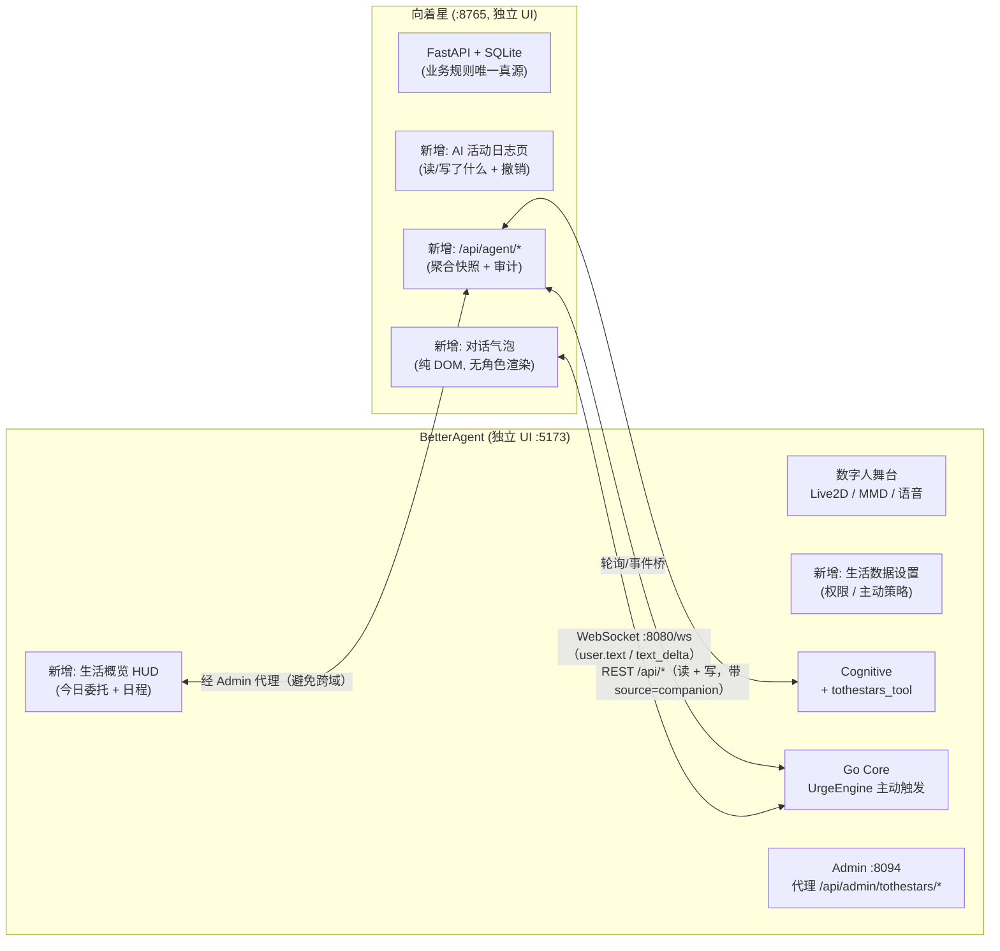

# BetterAgent × 向着星 联动修改方案（v1.1 · 已落地）

> 状态：**P0 / P1 / P2 全部实现**（实施记录与验收结果见文末 §12；落地过程中的取舍以代码为准并已回写本文档）
> 目标：作为作品集 Signature Project —《BetterAgent × 向着星》的工程与交互设计基准
> 核心命题：当 AI 同时掌握你的任务、日程与日记时，它应该在什么时候开口、记住什么、又该在什么时候保持沉默？

---

## 0. 一句话方案

两套应用**独立运行、独立 UI、不改前端代码库**；在“生活数据层（向着星）”与“陪伴 Agent（BetterAgent）”之间做**双向最小嵌入**，并配套四个设计机制——**权限模型 / 写入确认 / 审计与撤销 / 主动策略**，这四件套就是作品集的核心产出。

---

## 1. 背景与目标

### 1.1 作品集定位（来自《Portfolio_Guidance》）

- BetterAgent 提供“互动主体”：人设、语音、数字人、主动发起、长期记忆与工具能力；
- 向着星提供“生活轨迹”：每日委托、日程、长期目标、情绪/能量、日记、点数与奖励；
- 需要回答的四个 HCI 问题：
  1. **AI 应该知道多少？** → 记忆/数据权限模型；
  2. **AI 什么时候可以主动？** → 主动触发策略 + quiet mode；
  3. **AI 的人格如何保持连续？** → 情绪/关系状态注入与可解释机制；
  4. **AI 何时应该克制？** → 敏感数据规则、拒绝推断、不确定性表达。

### 1.2 用户可见目标

1. 数字人能读取向着星的日程表、每日委托、传说任务进度、日记摘要等；
2. 用户可以在对话中让数字人**修改**向着星数据：新增/完成委托、安排日程、更新长期目标等；
3. 数字人可在合适时机**主动**提及生活数据（可配置、可关闭）。

### 1.3 五条设计原则（贯穿所有改动）

1. **业务规则唯一真源**：结算、点数、顺延、日常委托复制等判断全部留在向着星后端；数字人只是“自然语言入口 + 调用既有 API”，绝不在 Prompt/LLM 侧重建规则。
2. **写操作必须：先提议 → 用户确认 → 执行 → 审计**（可撤销）。
3. **默认最小权限**：日记类默认不可读、不可主动提及；权限四档由用户显式配置。
4. **本地优先**：数据与密钥不出本机；两端仅通过 `127.0.0.1` 通信。
5. **联动必须可见**：两边 UI 都能看到对方存在的痕迹（HUD 概览 / 活动日志 / 对话气泡），而不是暗地里读写。

---

## 2. 总体架构



端口与依赖（均为本机）：

| 组件 | 端口 | 说明 |
|---|---|---|
| 向着星 FastAPI | 8765 | 现有，不改监听方式 |
| BetterAgent Go WebGateway | 8080 | 复用现有 WS 文本通道 |
| BetterAgent Admin REST | 8094 | 新增向着星代理接口 |
| BetterAgent 前端 | 5173 | 新增 HUD 组件 |
| BetterAgent 内部服务 | NATS/无端口 | 认知/记忆/TTS 等不变 |

---

## 3. BetterAgent 侧修改方案

### 3.1 新增模块

| # | 新增 | 路径 | 职责 |
|---|---|---|---|
| 1 | 向着星工具集 | `services/cognitive/tools/tothestars_tool.py` | 实现 `BaseTool`，HTTP 调向着星 REST；读写分离、写操作返回“待确认”提案 |
| 2 | 生活数据权限门控 | `shared/life_data_permissions.py` | 读取 `config.yaml` 的权限矩阵；供工具注册与 PromptBuilder 共用同一真源（避免“提示词说不能读、工具却能调”的不一致） |
| 3 | 生活事件桥 | `services/life_bridge/`（形态参考 `services/game_watcher/`） | 轮询向着星 `/api/agent/snapshot`，把状态变化（临期、未完成、里程碑）转成事件上报 Go Core |
| 4 | 生活概览 HUD | `frontend/apps/stage-web/src/components/LifeHUDWidget.vue` | 今日委托完成度、日程时间轴摘要、传说任务进度；点击可向数字人发一句上下文提示 |
| 5 | 生活数据设置页 | `frontend/packages/stage-pages/src/pages/settings/modules/life-data.vue` | 权限四档矩阵 + 主动策略（开关/频率/静默时段/日记禁提） |
| 6 | 设置 store | `frontend/packages/stage-ui/src/stores/modules/life-data.ts` | 上述设置的持久化与同步（参考已实现的“语言模块”模式） |

### 3.2 既有文件改动

| 文件 | 改动 |
|---|---|
| `services/cognitive/tool_registry.py` + 注册处 | 注册 `tothestars_*` 工具；无权限的工具**不进入 tools_schema**（门控在“模型看不见”层，而非靠提示词劝阻） |
| `services/cognitive/prompt_builder.py` | 有读权限时注入「生活快照」（今日委托完成度、日程、传说进度）与「克制规则」；日记摘要仅在对应权限开启且用户问起时注入 |
| `services/cognitive/cognitive_engine.py` | 写操作两步确认协议：模型只能产出「提议」（结构化 proposal），用户确认后才真正调用执行；复用 `agent.tool.activity` 在字幕层显示“正在翻你的委托本…” |
| `core/internal/webgateway/game_event_handler.go`（参照） | 新增 `POST /api/life-event`（复用 `/api/game-event` 的 token 与权重表模式），事件类型：`morning_brief` / `evening_review` / `deadline_near` / `required_unfinished` / `streak_milestone` |
| `core/internal/engine/urge_engine.go` | 事件权重表扩展 life 类别；静默时段（quiet hours）判定与主动频率上限 |
| `config/config.yaml` | 新增 `integration.tothestars` 段：`enabled` / `endpoint` / `permissions` / `proactive` |
| `admin/backend/main.py` | 新增 `/api/admin/tothestars/*` 反向代理（`TOTHESTARS_URL` 环境变量，`httpx`，模式同现有 `COMPANION_URL` 代理） |
| `runner.py`（可选） | 可选把向着星纳入编排；失败不阻塞主链路 |

### 3.3 修改后 BetterAgent 多出什么、发生什么变化

**新增界面**
- 舞台新增「生活概览 HUD」：今日委托 N/M、今日日程下一项、传说任务进度条；
- 设置新增「生活数据」模块页：权限矩阵 + 主动策略。

**对话能力变化**
- 问：“我今天还有什么没做？” → 她直接答（读权限开启时）；
- 说：“帮我把『取快递』加到明天，难度 B”——她先复述：“明天加一条『取快递』，难度 B，必要委托吗？” → 你确认 → 写入成功并回报；
- 到点主动开口：“今天的必要委托还差两条，现在都十点了——要不要我陪你把它们过一遍？”（策略开启时）。

**内核变化**
- 认知服务多了一个工具族与统一权限门控；
- Go Core 多了一条“生活事件”摄入链路与静默时段策略；
- 管理面板多了一组代理接口。

---

## 4. 向着星侧修改方案

### 4.1 新增模块

| # | 新增 | 路径 | 职责 |
|---|---|---|---|
| 1 | `agent_audit` 表 | `app/db/migrations.py` + `app/repositories/audit_repo.py` | 记录每次 AI 读/写：时间、动作、对象、参数、结果、撤销载荷；本地表，随数据库备份 |
| 2 | 审计 API | `app/api/routes_agent.py` | `GET /api/agent/audit`（列表/筛选）、`POST /api/agent/audit/{id}/undo`（撤销） |
| 3 | 聚合快照 API | `app/api/routes_agent.py` | `GET /api/agent/snapshot`：一次返回今日委托+必要委托完成情况、今日日程、传说进度、点数、最近日记摘要（字段按角色剪裁） |
| 4 | AI 活动日志页 | `frontend/js/agent-activity.js` + `frontend/css/` | 时间线视图：来源标记（AI/我）、一键撤销、筛选；演示透明性的核心画面 |
| 5 | 对话气泡 | `frontend/js/agent-chat.js` + `frontend/css/` | 右下角浮动聊天框（纯 DOM）。连 `ws://127.0.0.1:8080/ws?token=<WEBGATEWAY_TOKEN>`，发送 `{type:"user.text", payload:{text}}`，接收 `agent.text_delta` / `agent.state_change` / `agent.tool_activity` 渲染为气泡与状态行 |

### 4.2 既有文件改动

| 文件 | 改动 |
|---|---|
| `app/api/server.py` | 挂载 `routes_agent`、静态资源；可选注入 Agent WS 配置 |
| `app/services/*.py`（quests / schedule / legends / states） | 写操作统一加 `actor` 来源参数（`me` / `companion`），执行后写 `agent_audit`；**所有既有业务规则逻辑不变** |
| `frontend/index.html` + `frontend/js/react-app.js` | 侧边导航新增「AI 活动」；页面挂载气泡组件 |
| `app/core/config.py` | 新增 `AGENT_WS_URL` / `AGENT_WS_TOKEN`（从环境变量读取，缺省关闭气泡） |
| `README.md` | 补充“与 BetterAgent 联动”一节与联调步骤 |

### 4.3 修改后向着星多出什么、发生什么变化

**新增界面**
- 侧边导航多一项「AI 活动」：谁改了什么、什么时候、可撤销；
- 右下角多一个对话气泡：不用离开向着星就能和数字人说话（如“帮我完成今天的必要委托”）。

**数据层变化**
- 多一张 `agent_audit` 表（不影响既有表结构，迁移使用现有 `CREATE TABLE IF NOT EXISTS` 模式）；
- 所有写接口多一个可选 `actor` 参数，缺省仍是 `me`（旧前端零改动）。

**明确的边界（不做）**
- 不新增任何业务规则到 AI 侧；
- 不把数据库直接暴露给 Agent（只走 REST）；
- 不为 AI 单独维护一套数据视图（聚合接口只是裁剪现有数据，不存储第二份）。

---

## 5. 接口映射表（BetterAgent 工具 ↔ 向着星 API）

| BetterAgent 工具 | 方向 | 向着星接口 | 权限档 | 说明 |
|---|---|---|---|---|
| `get_life_snapshot` | 读 | `GET /api/agent/snapshot` | 按类目 | 一次拿今日概览，供 Prompt 注入与回答 |
| `get_commissions` | 读 | `GET /api/quests` / `/api/quests/today` | 委托·可读 | 支持指定日期 |
| `get_schedule` | 读 | `GET /api/schedule/*` | 日程·可读 | 周表/日时间轴 |
| `get_legend_progress` | 读 | `GET /api/legends` | 长期目标·可读 | 指标进度与检查点 |
| `get_journal_summary` | 读 | `GET /api/states`（摘要字段） | 日记·默认关 | 默认仅“最近一次心情/能量”，正文需显式开启 |
| `propose_create_commission` | 写（提议） | —（仅生成提案） | 委托·可写 | 等用户确认 |
| `create_commission` | 写 | `POST /api/quests` | 委托·可写 | 携带 `actor=companion`，写审计 |
| `complete_commission` | 写 | `POST /api/quests/{id}/complete` | 委托·可写 | 同上 |
| `update_commission` | 写 | `PUT /api/quests/{id}` | 委托·可写 | 标题/描述/难度/必要委托 |
| `add_schedule_plan` | 写 | `POST /api/schedule/*` | 日程·可写 | 与委托绑定或自定义计划 |
| `undo_agent_action` | 写 | `POST /api/agent/audit/{id}/undo` | 审计·可写 | 对话里“撤销刚才那步” |

---

## 6. 权限与安全设计（作品集核心图 1）

### 6.1 四档权限矩阵（每类数据独立配置）

| 档位 | 含义 | 适用默认 |
|---|---|---|
| `read_write_proactive` | 可读、可写、可主动提及 | 委托、日程 |
| `read_only` | 可读，不可改，可主动提及 | 传说任务、点数 |
| `on_request` | 只有用户明确问起才读取，不主动提 | 日记摘要、专注记录 |
| `hidden` | 完全不可见（工具不注册、Prompt 不注入） | 日记正文与照片（默认） |

设置面板提供每类数据的四档单选，并强制显示一句解释：“这条设置会立即改变她能看到和说到的东西。”

### 6.2 写入确认协议

```
用户请求 → 模型产出结构化「提议」(不进 tools 执行)
        → 数字人以角色口吻复述提案（含关键参数）
        → 用户确认（“好/可以/就这样”）
        → Cognitive 执行工具 → 向着星写入 + 审计
        → 数字人回报结果；用户可随时说“撤销”
```

### 6.3 审计与撤销

- 每条记录包含：`ts / actor / action / target_type / target_id / params / result / undo_payload`；
- 撤销只回放“逆操作”（如删除刚创建的委托），不重算历史结算；
- 活动日志页明确区分「AI 改动」与「我的改动」，这是透明性证据。

### 6.4 安全边界

- 仅监听 `127.0.0.1`；WS 需 `WEBGATEWAY_TOKEN`；life-event 需独立 token；
- 生活数据中的自由文本（日记、委托描述）在 Prompt 中作为**数据**包裹，不作为指令执行（防注入）；
- 双端都不把密钥/个人数据写入日志。

---

## 7. 主动策略设计（作品集核心图 2）

| 触发场景 | 事件 | 默认权重 | 静默时段 | 可关闭 |
|---|---|---|---|---|
| 晨间简报（今日委托 + 日程） | `morning_brief` | 中 | 否（可设时间窗） | 是 |
| 晚间复盘提醒（日记/结算） | `evening_review` | 中 | 是（23:00–07:00） | 是 |
| 传说任务检查点临期 | `deadline_near` | 高 | 是 | 是 |
| 必要委托未完成（20:00 后） | `required_unfinished` | 高 | 是 | 是 |
| 连续完成里程碑 | `streak_milestone` | 低 | 是 | 是 |

所有主动消息都遵循：**频率上限（每小时/每天）× 静默时段 × 用户心情（情绪引擎）**；三者为“与”关系，任何一个不允许就不开口。这直接对应指导文档里的“主动过少像工具，主动过多像打扰”。

---

## 8. 分阶段路线图

| 阶段 | 内容 | 预估 | 作品集产出 |
|---|---|---|---|
| **P0** | 只读工具 + 权限模块 + 确认式写委托/完成委托 + `agent_audit` + 活动日志页 | 2–3 天 | 权限模型、写入确认流程、审计截图 |
| **P1** | 双向微嵌入：LifeHUD（数字人侧）+ 对话气泡（向着星侧） | 2–3 天 | 双向联动的交互证据链 |
| **P2** | 主动层：life-event → UrgeEngine + quiet mode + 频率设置 | 2–3 天 | 主动策略 / 克制机制图 |
| **研究** | Diary study 5–7 天 / A-B（被动 vs 主动+记忆）/ 半结构访谈 | 1 周 | Evaluation 与 Iteration 章节 |

每阶段结束都产出“可演示 + 可讲解 + 有证据”的素材，不做“一次性做完再补研究”。

---

## 9. 演示脚本（作品集 / 答辩用）

1. **晨间简报**：早上打开数字人 → 她主动报今日必要委托与日程；
2. **对话改数据**：说“帮我把『取快递』加到今晚 8 点” → 她复述确认 → 写入 → 切到向着星看到新委托与时间轴片段；
3. **透明与撤销**：打开「AI 活动」页看到带来源标记的记录 → 点撤销 → 委托消失，数字人确认“已经帮你撤掉了”；
4. **边界演示**：把日记权限切到“完全不可见” → 再问她“我昨天写了什么” → 她明确表示看不到，而不是编造；
5. **主动与克制**：打开 quiet mode → 晚间不再打扰；关闭后恢复。

---

## 10. 风险与不做清单

**风险**
- 作品集展期前动到两端核心 → 用“只加不改业务规则”控制风险；
- LLM 幻觉写错数据 → 确认协议 + 审计 + 撤销兜底；
- 数据隐私争议 → 权限默认最严、日记默认关、全部本地。

**明确不做**
- ❌ 合并前端代码库（方案 1）；
- ❌ 让 LLM 参与结算/点数等业务判断；
- ❌ Agent 直连 SQLite；
- ❌ 为了演示而预置“假数据回答”。

---

## 11. 验收清单（P0 部分）

1. 关闭所有权限时，工具不进 `tools_schema`，模型无法读取任何生活数据；
2. 开启委托读权限后，问“今天有什么没做”能准确列出（与向着星页面一致）；
3. 写委托必须经过一次确认；未确认不产生任何写入；
4. 每次写入在 `agent_audit` 有记录，且能在活动日志页撤销；
5. 日记权限为 `on_request` 时，主动简报不包含日记内容；
6. quiet mode 开启后，晚间不再触发主动消息；
7. 断开向着星服务时，数字人正常对话（工具报“暂时读不到数据”，不崩溃）。

---

*本文档已按落地实现回写；如与代码有出入，以代码为准。*

---

## 12. 实施记录（v1.1）

### 12.1 分步落地与产物

| 步骤 | 内容 | 主要产物 |
|---|---|---|
| 1 | 向着星审计层 + Agent 接口 | `app/db/database.py`（agent_audit）、`app/repositories/audit_repo.py`、`app/services/audit_service.py`、`app/api/routes_agent.py`、各写路由的 `X-Actor` 审计点；`tests/test_agent_api.py` |
| 2 | 权限内核 + 只读工具 + 快照注入 | `shared/life_data_permissions.py`、`services/cognitive/tools/tothestars_tool.py`、`tool_registry` 注册、`cognitive_engine` 每轮门控、`prompt_builder` 快照与边界规则、`integration.tothestars` 配置段 |
| 3 | 写入确认协议 | 提议工具族（零写入）+ `execute_proposal` 确定性执行器、`cognitive_engine` 确认词判定 / TTL / 系统事件注入、边界规则第 4 条 |
| 4 | BetterAgent「AI 权限」设置页 | Admin `/api/admin/config` 的 tothestars 段与校验、`betteragent-admin-api.ts`、`stores/modules/life-data.ts`、`components/modules/LifeData.vue`、模块列表卡片 |
| 5 | 向着星侧 UI | `frontend/js/react-app.js`（AI 活动页与撤销）、`frontend/js/agent-chat.js`（气泡）、`frontend/css/agent-ui.css`、`app/core/config.py` 的 `AGENT_WS_*`、`GET /api/agent/chat-config` |
| 6 | 舞台生活 HUD | Admin `/api/admin/tothestars/*` 反向代理、`LifeHUDWidget.vue`、`Actions/Life.vue`（桌面/移动端挂载） |
| 7 | 主动层 | Go `life_event_handler.go` + `LIFE_EVENT_TOKEN` + 权重表 `game_events.games.life`；`UrgeEngine` 静默时段/频率上限；`services/life_bridge/life_poller.py` + `runner.py` 守护 |
| 8 | 联调验收与文档 | 合并验收脚本（22 项）、README/CHANGELOG/ARCHITECTURE 回写 |

### 12.2 与设计稿的差异（都是为"更安全 / 更少侵入"做的取舍）

1. **写执行工具从不进模型可见表**：设计稿把 `create_commission` 等列为工具，实现改为只暴露 `tothestars_propose_*`，确认后由引擎调用 `execute_proposal()`。模型在任何时候都无法直接写库，确认前也不可能"先斩后奏"。
2. **确认判定是确定性的**：只认短而明确的整句（"好的""可以""取消"…），长句/疑问/新指令一律按安全默认作废（提议 TTL 10 分钟），避免"好烦啊"被误判为确认。
3. **生活事件与游戏事件共用 `:8090` 监听与权重表结构，但 token 独立**（`LIFE_EVENT_TOKEN`）：一条 token 泄漏不影响另一条链路；静默/频率在 `UrgeEngine` 统一判定，避免两处策略打架。
4. **频率上限按"实际开口次数"计**（含无聊搭话），0 = 不限制；静默时段对所有主动消息生效。
5. **设置页真源在 `config.yaml`**：前端只做展示与校验（后台写盘 + NATS 热刷新；life bridge 额外按文件 mtime 刷新缓存）。
6. **HUD 不受权限限制**：权限约束的是数字人能看什么；HUD 是用户自己看自己的数据，因此经 Admin 代理直读快照。
7. 桥的额外配置键（`poll_interval_seconds` / `deadline_days`）放在 `integration.tothestars.proactive`，设置页不编辑它们、保存时也不会误删。

### 12.3 验收结果（自动化）

- **合并验收脚本 22 项全部通过**：权限全关工具不可见/提示词不注入、快照与页面数据一致、未确认零写入、确认后落库并带工具活动字幕、审计留痕与一键撤销、日记 on_request 不进简报且正文/照片被裁剪、静默时段与频率上限单测、服务不可达友好失败、HUD Admin 代理与 503 降级。
- **测试规模**：Go `go test ./...` 全绿（含生活事件 handler 9 测、UrgeEngine 静默/频率 4 测）；Python 认知/权限/工具/协议/桥测试全绿；前端 store vitest 4/4、改动文件 lint 0/0。
- **真实链路冒烟**：临时向着星实例上完成"委托创建 → 快照读取 → 提议 → 确认落库 → 审计 → 撤销"与"生活桥 → /api/life-event 契约"；WebGateway 真实 token 握手收到 `agent.text_delta` 文本回复。

### 12.4 演示前检查清单

1. `python runner.py`（自动重编 Go core、拉起 life bridge）。
2. 在向着星的启动环境设置 `AGENT_WS_TOKEN`（= BetterAgent 的 `WEBGATEWAY_TOKEN`），重启向着星。
3. BetterAgent 设置 → 生活数据（向着星）：打开联动；按演示需要开启「允许主动提起」并设置静默时段。
4. 演示动线：向着星右下角气泡提问 → 舞台 HUD「让她讲讲今天」→ 对话里让她加一条委托（复述确认）→ 向着星「AI 活动」页看来源与撤销 → 主动简报（晨间/晚间窗口或临时把时间窗调宽验证）。
